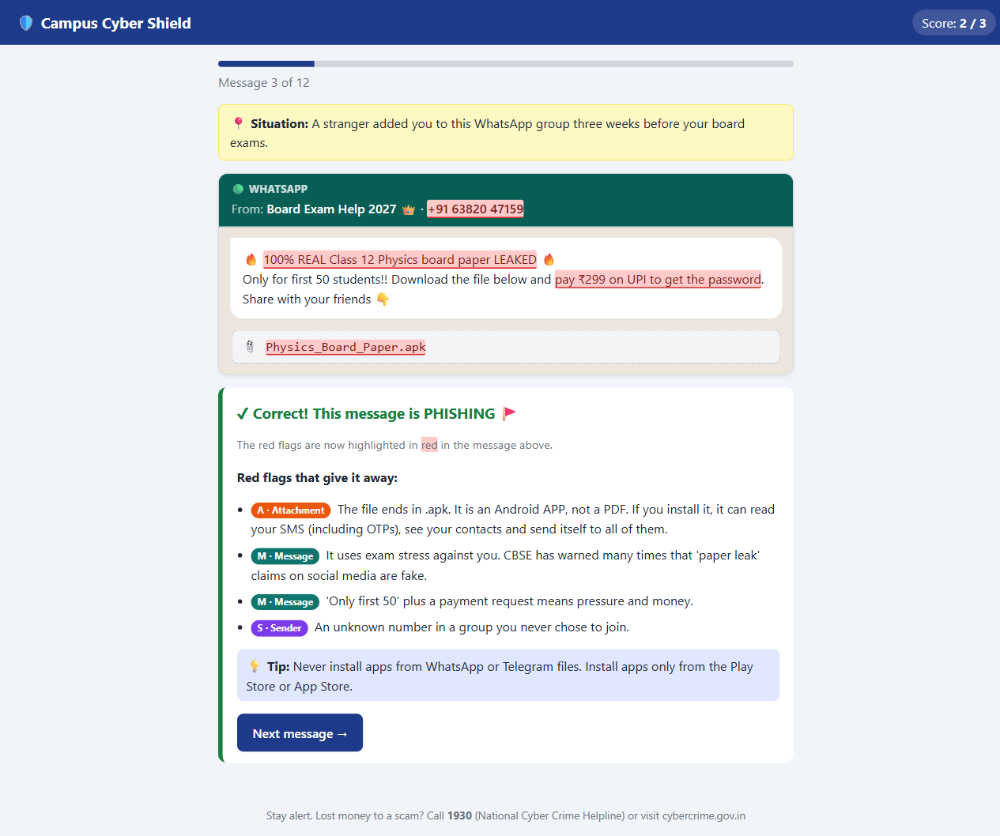
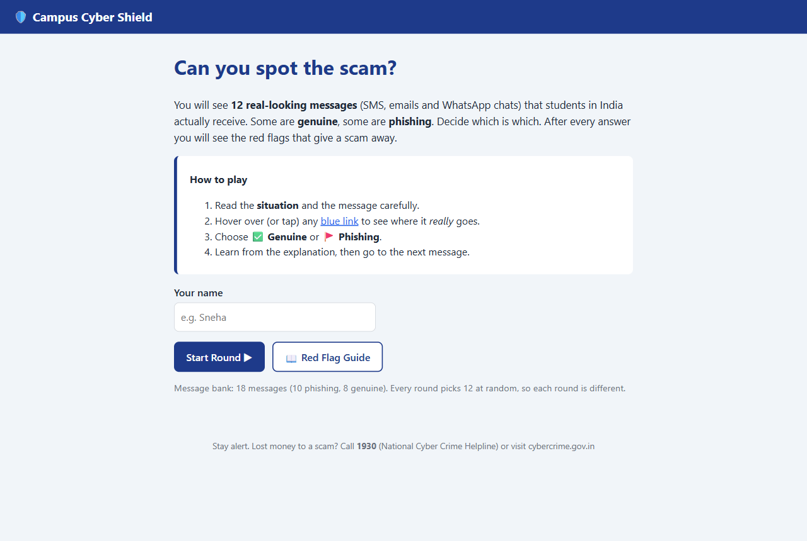
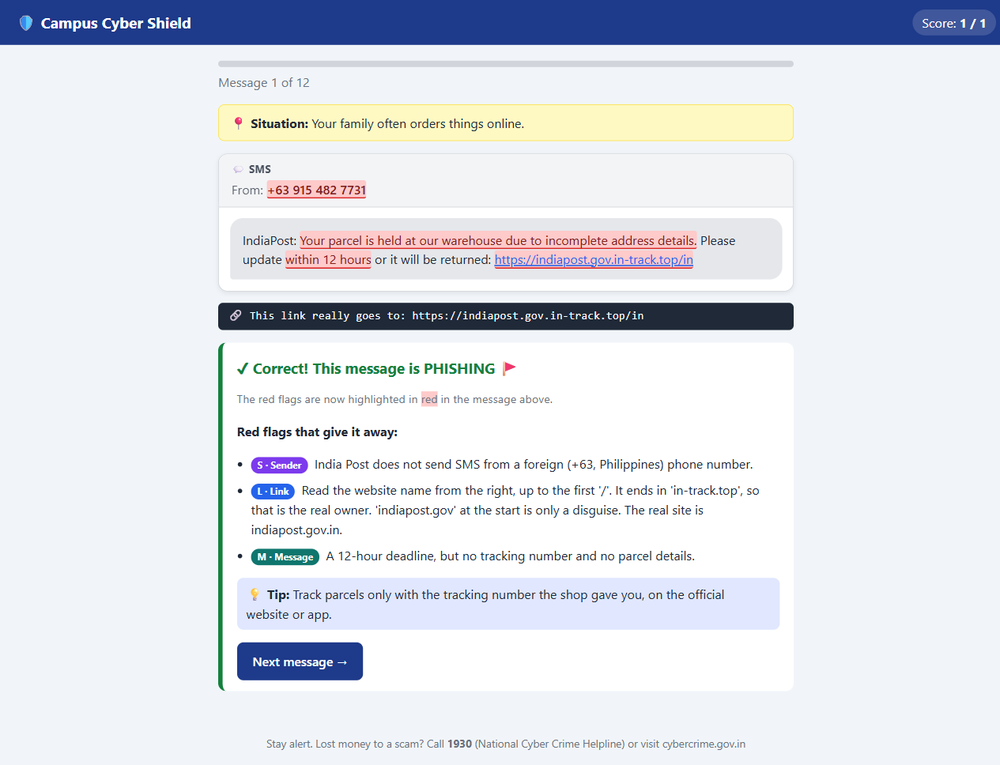
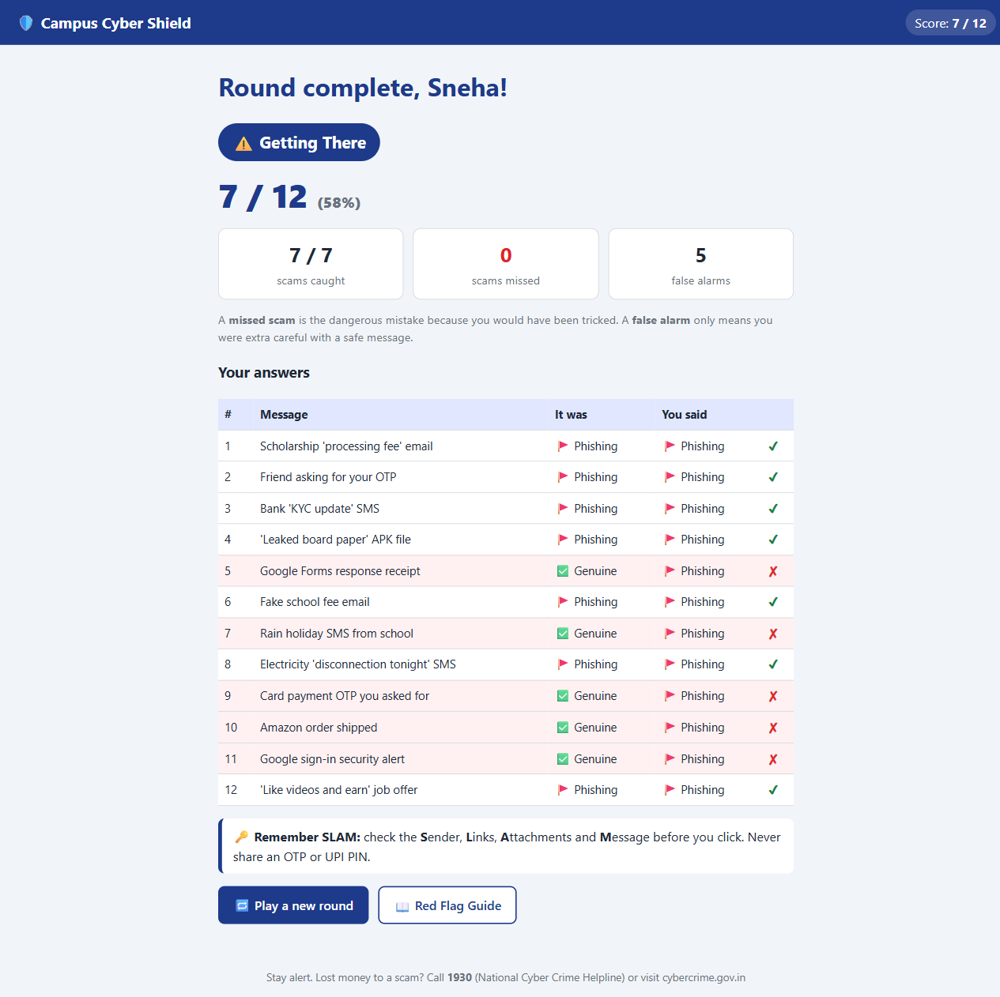
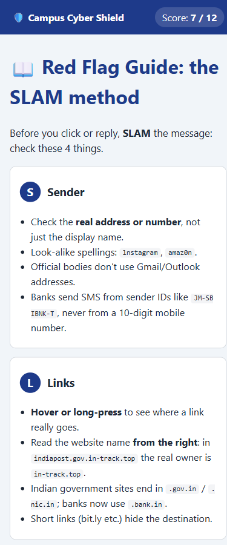
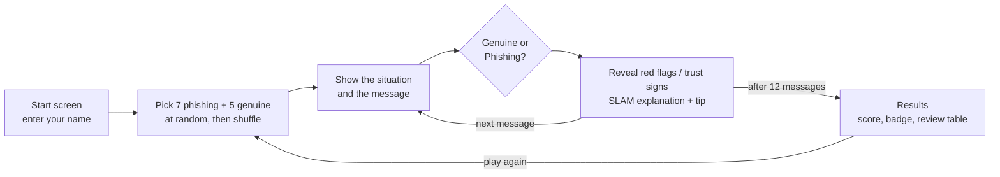

<div align="center">

# 🛡️ Campus Cyber Shield

### Can you spot the scam?

A phishing-spotting game that teaches school students to catch the red flags in SMS, email and WhatsApp messages, *before* they click.


[](LICENSE)

<!-- After turning on GitHub Pages, add the live link here:
**[▶ Play it online](https://USERNAME.github.io/campus-cyber-shield/)**
-->

[Quick start](#-quick-start) · [Features](#-features) · [Message bank](#-the-message-bank) · [How it works](#-how-it-works) · [Add a message](#-add-your-own-message)



</div>

## 🎯 The challenge

> *Phishing messages and suspicious links are increasingly common, and students are rarely trained to spot the warning signs before clicking.*
>
> Gritty Coder '26, Senior tier, problem statement **SC-02: Campus Cyber Shield** (Cybersecurity Awareness)

Campus Cyber Shield turns this into a game. The player reads realistic messages that students in India actually receive (fake KYC updates, "processing fee" scholarships, "leaked board papers", UPI PIN tricks) mixed with genuine ones. They decide which is which, get a score, and after every answer see **exactly which red flags** gave the scam away.

## 🚀 Quick start

No installation, no internet and no server needed.

1. Download this repo (**Code → Download ZIP**) and unzip it, or clone it:
   ```bash
   git clone https://github.com/<username>/campus-cyber-shield.git
   ```
2. Double-click **`index.html`**. It opens in any browser (Chrome, Edge, Firefox, Safari).

### How to play

1. Read the **situation** and the message carefully.
2. Hover over (or tap) any blue link to see where it *really* goes.
3. Choose **✅ Genuine** or **🚩 Phishing**.
4. Learn from the explanation, then go to the next message. After 12 messages you get your results.

## ✨ Features

### Mapped to the problem statement

| Required deliverable | How Campus Cyber Shield does it |
|---|---|
| A bank of at least 12 messages, mixed genuine and phishing | **18 messages** (10 phishing, 8 genuine) across **SMS, email and WhatsApp**, each based on a real scam type seen in India |
| A scoring mechanism | +1 for every correct answer, a live score in the top bar, and a final % with a badge. **Scams missed** (dangerous) are counted separately from **false alarms** (safe messages wrongly flagged) |
| A clear explanation of red flags after each attempt | The red flags light up **inside the message itself**, and a list explains each one with a **SLAM** tag (Sender, Link, Attachment, Message), plus a safety tip |
| A working demo of a full round | Every round picks **12 messages at random** (7 phishing + 5 genuine), so each round is different |

### Extras

- **"Situation" line**: gives the context for each message (e.g. *"You just logged in to your Gmail on a computer in the school lab"*), because whether an OTP or alert is safe depends on what *you* just did.
- **Hover-to-reveal links**: hovering, tapping or tabbing to a link shows where it really goes, like a browser's status bar. After answering, disguised links print their real address next to them.
- **Made for Indian students**: UPI, OLX, DigiLocker, board exams, a school rain holiday, TRAI SMS sender IDs (`-T`, `-S`) and RBI's new `.bank.in` domain for banks.
- **Red Flag Guide**: a one-page SLAM cheat-sheet, including where to report scams in India.
- **Results review**: a table of every answer, so the player can see where they went wrong.
- **Works on phones**: responsive layout, and links work by tap as well as hover.

## 📸 Screenshots

<table>
  <tr>
    <td width="50%" valign="top">
      <br>
      <sub><b>Start screen</b>: type your name and start a round of 12.</sub>
    </td>
    <td width="50%" valign="top">
      <br>
      <sub><b>Hover-to-reveal</b>: the "India Post" link really goes to <code>in-track.top</code>.</sub>
    </td>
  </tr>
  <tr>
    <td width="50%" valign="top">
      <br>
      <sub><b>Results</b>: score, badge, scams missed vs false alarms, and every answer reviewed.</sub>
    </td>
    <td width="50%" valign="top" align="center">
      <br>
      <sub><b>Red Flag Guide on a phone</b>: the SLAM method.</sub>
    </td>
  </tr>
</table>

## 📬 The message bank

18 messages: **10 phishing + 8 genuine**, across 6 SMS, 7 emails and 5 WhatsApp chats. Each round uses 12 of them.

<details>
<summary><b>See all 18 messages</b> (spoilers, so play a round first!)</summary>
<br>

| # | Message | Channel | Answer | What it teaches |
|---|---|---|---|---|
| 1 | Bank "KYC update" | SMS | 🚩 Phishing | Banks never text from a personal number; `sbi-yono-kyc.co.in` is not SBI |
| 2 | Scholarship "processing fee" | Email | 🚩 Phishing | Government schemes don't use Gmail; you never pay to receive money |
| 3 | Friend asking for your OTP | WhatsApp | 🚩 Phishing | A saved contact can be hacked; your OTP is the key to your account |
| 4 | Instagram "copyright violation" | Email | 🚩 Phishing | Look-alike domain: `lnstagram` starts with a small L |
| 5 | India Post "parcel held" | SMS | 🚩 Phishing | Read the domain from the right: `indiapost.gov.in-track.top` |
| 6 | "Like videos and earn" job | WhatsApp | 🚩 Phishing | Task-job scams that move you to Telegram and ask for "deposits" |
| 7 | "Leaked board paper" file | WhatsApp | 🚩 Phishing | A `.apk` file is an app, not a PDF |
| 8 | Fake school fee email | Email | 🚩 Phishing | Button text says one thing, the link goes somewhere else |
| 9 | Electricity "disconnection tonight" | SMS | 🚩 Phishing | "Call this officer" traps and bad grammar |
| 10 | OLX buyer "enter PIN to receive" | WhatsApp | 🚩 Phishing | You never need a UPI PIN to *receive* money |
| 11 | Card payment OTP you asked for | SMS | ✅ Genuine | Registered `-T` sender ID; matches what you just did |
| 12 | Google sign-in security alert | Email | ✅ Genuine | Real domain, no threats: "If this was you, you don't need to do anything" |
| 13 | Class teacher's reminder | WhatsApp | ✅ Genuine | Someone you know, in the official group, asking for nothing |
| 14 | DigiLocker marksheet issued | Email | ✅ Genuine | Only the government can use `.gov.in` |
| 15 | Amazon order shipped | Email | ✅ Genuine | Real domain, and it matches your actual order |
| 16 | Money received from Amma | SMS | ✅ Genuine | A real credit alert only informs; it never asks you to click or call |
| 17 | Rain holiday SMS from school | SMS | ✅ Genuine | Urgent is not the same as fake: it asks you to do nothing risky |
| 18 | Google Forms response receipt | Email | ✅ Genuine | It confirms something you just did |

</details>

## 🧠 How it works



- **Picking a round**: `filter` splits the bank into phishing and genuine messages, a Fisher-Yates `shuffle` mixes each list, `slice` takes 7 + 5, and the 12 are shuffled together.
- **Showing a message**: `formatText()` fills in `{name}` and `{school}`, then runs `escapeHtml()` so no message text (or player name) can ever run as code. That's XSS protection inside a security app. Regular expressions then turn the marks from `messages.js` into highlights and links.
- **Revealing the answer**: the highlights are already in the card but invisible. Adding the `revealed` class turns them red or green, and CSS `::after` with `attr(data-real)` prints the real address next to each disguised link.
- **Scoring**: each answer is saved. The results screen works out the %, the badge (90%+ Champion, 70%+ Sharp Spotter, 50%+ Getting There), and counts **missed scams** (false negatives) separately from **false alarms** (false positives).

### Project structure

```
campus-cyber-shield/
├── index.html     # the 4 screens: Start, Quiz, Results and Red Flag Guide
├── style.css      # SMS / email / WhatsApp looks, highlights and phone layout
├── messages.js    # the message bank: 18 messages with their red flags and tips
├── app.js         # quiz logic: picking a round, answers, scoring and results
└── screenshots/   # images used in this README
```

### Tech used

HTML, CSS and plain JavaScript, with no libraries, frameworks or build step. Main ideas: an array of objects as a small database, DOM manipulation, event listeners, template literals, the Fisher-Yates shuffle, regular expressions, HTML escaping, and a responsive layout with `@media`.

## 📝 Add your own message

Open `messages.js`, copy any `{ ... }` block, give it a new `id` and edit the text:

```js
{
  id: 19,
  title: "KBC lottery SMS",
  channel: "sms",                      // "sms", "email" or "whatsapp"
  from: "[[+91 70214 58390]]",
  situation: "You have never entered any lottery.",
  body: "[[Congratulations! You have WON ₹25,00,000]] in the KBC lucky draw. Claim now: [[{{kbc-official.in/claim|http://kbc-lucky-winner.xyz/pay}}]]",
  isPhishing: true,
  points: [
    { slam: "S", text: "Sent from a personal mobile number, not a registered sender ID." },
    { slam: "M", text: "You can't win a lottery you never entered." },
    { slam: "L", text: "The link says kbc-official.in but really goes to kbc-lucky-winner.xyz." }
  ],
  tip: "Real prizes never ask you to click a link or pay a fee to claim them."
}
```

Email messages can also have a `subject`, and any message can have an `attachment`. These marks work in `from`, `subject`, `body` and `attachment`:

| Mark | Meaning |
|---|---|
| `[[text]]` | red flag (turns red after answering) |
| `[+text+]` | trust sign (turns green after answering) |
| `{{shown text\|real address}}` | a link that shows one thing but really goes somewhere else |
| `{name}` / `{school}` | replaced with the player's name / `SCHOOL_NAME` |

**Customise it:**
- To use your own school's name, change `SCHOOL_NAME` at the top of `messages.js`.
- To change the round size, change `PHISHING_PER_ROUND` and `GENUINE_PER_ROUND` at the top of `app.js`. The bank needs at least that many messages of each type.

## 🌐 Put it online

The app is a static site, so GitHub Pages can host it for free:

1. Push this repo to GitHub.
2. Go to **Settings → Pages**. Under **Build and deployment**, choose **Deploy from a branch**, pick **`main`** and **`/ (root)`**, then **Save**.
3. After a minute, it's live at `https://<username>.github.io/campus-cyber-shield/`.

## 🔒 Safety and privacy

- The links in the messages are **not real links**. They are plain text that shows its address on hover, so nothing can be clicked or opened.
- The app collects no data and sends nothing anywhere. The name you type is only used on the page during that round.
- The phone numbers, names, payment details and scam websites are all made up. The genuine messages use the real official domains (like `google.com` and `digilocker.gov.in`) so players learn what the real thing looks like.

## 📞 Report a scam in India

- **Lost money?** Call **1930** (National Cyber Crime Helpline) immediately, or report at [cybercrime.gov.in](https://cybercrime.gov.in/).
- **Got a suspicious call, SMS or WhatsApp** (no money lost)? Report it on [Chakshu](https://www.sancharsaathi.gov.in/sfc/) at sancharsaathi.gov.in.

## 📚 References

The scam messages are based on these real advisories and reports:

- RBI asks banks to move to the `.bank.in` domain: [Business Standard](https://www.business-standard.com/finance/news/rbi-asks-banks-to-complete-migration-to-bank-in-domain-by-october-31-2025-125042201515_1.html)
- TRAI SMS header suffixes `-P` / `-S` / `-T` / `-G`: [Tanla](https://www.tanla.com/blog-posts/trai-mandates-new-message-suffixes-heres-what-you-need-to-know)
- CBSE advisory on fake "paper leak" claims (Feb 2026): [cbse.gov.in](https://www.cbse.gov.in/cbsenew/documents/Advisory_Fake_News_Rumours_18022026.pdf)
- UPI fraud types (PIN to "receive" money, fake collect requests): [Razorpay](https://razorpay.com/blog/upi-frauds-types-tactics/)
- WhatsApp "wedding invitation" APK scam: [Business Standard](https://www.business-standard.com/finance/personal-finance/got-a-wedding-invitation-via-whatsapp-beware-of-this-latest-scam-124112700825_1.html)
- The SLAM method: [Cymulate](https://cymulate.com/cybersecurity-glossary/slam-method/)
- Related: Google's [Phishing Quiz](https://phishingquiz.withgoogle.com/)

## 📄 License

[MIT](LICENSE). Schools and teachers are free to use, copy and adapt it.

---

<div align="center">
<sub>Built for <b>Gritty Coder '26</b>. Stay alert, and never share an OTP or UPI PIN. 🛡️</sub>
</div>
